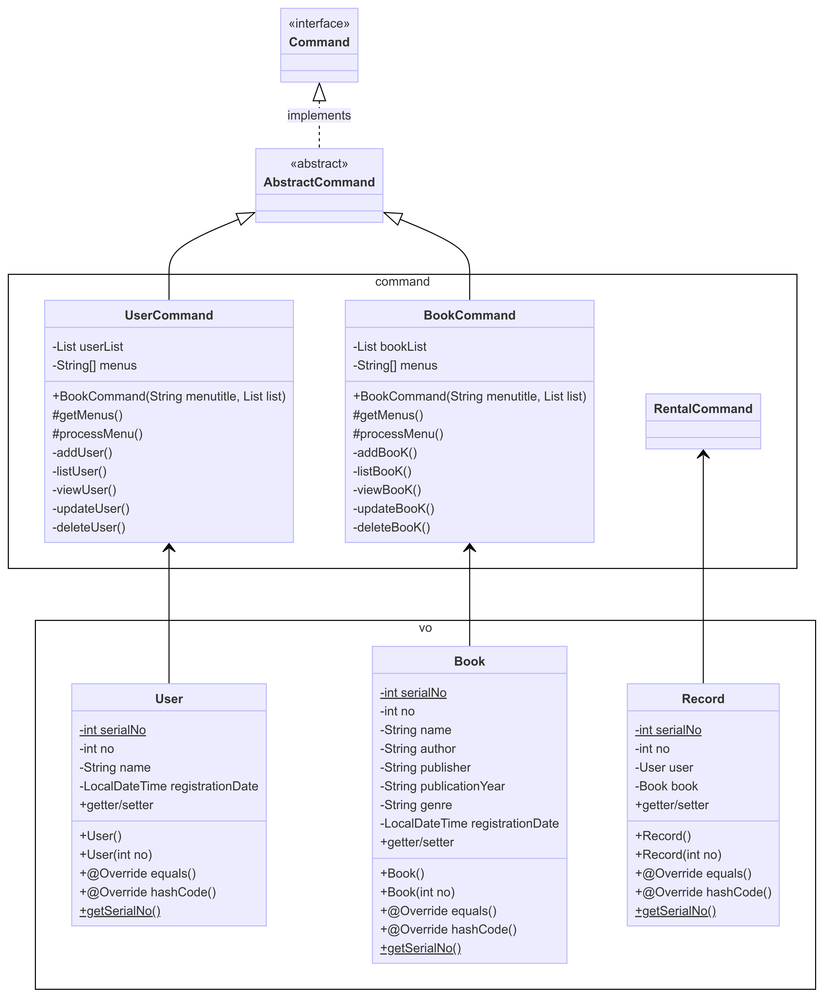

##  bitcamp-project3

## Home

메인

## DummyData

더미데이터

## page

## Page

\<\<interface\>\> 
+void setSelectMenu() 
+void menu() 
+public void getScanner() 
+int setSubMenuNum(int) 
+String printTUI() 
+void selectMenu(int) 
